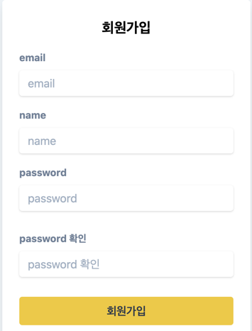

# 지하철 노선 관리, 사용 프로그램

## spec

- gradle 4.10.3
- jdk 1.8
- springboot 2.2.5

## 기능 목록 

### 어드민 페이지

- 지하철 역 추가 기능
- 지하철 노선 추가 기능
- 지하철 노선에 역을 추가하는 기능
- 노선의 역 사이의 거리와 시간을 설정 할 수 있는 기능

### 사용자 페이지

- 로그인 기능
- 회원가입 기능
- 회원 정보 수정 기능
- 지하철 노선을 전체를 볼 수 있는 기능
- 지하철 경로 검색 기능
- 검색된 경로를 자신의 즐겨찾기에 저장 할 수 있는 기능

## 요구 사항

- [x] 회원정보를 관리하는 기능 구현
    - [x] 회원가입
    - [x] 로그인
    - [x] 로그인 후 회원정보 조회/삭제

- [x] 자신의 정보만 수정 가능 해야하고 로그인이 선행 되어야함

- [x] 토큰의 유효성 검사와 본인 여부를 판단하는 로직 구현

- [x] API 문서화를 위한 테스트코드 작성

- [x] 페이지 연동